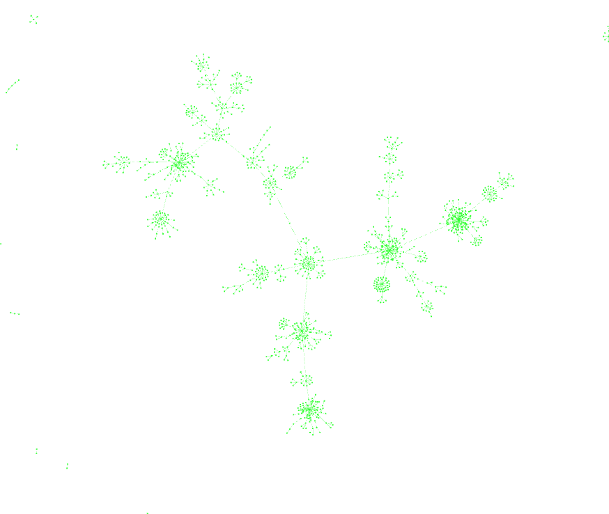

# Open Oil - Test for ngraph-pixi

__This test is using https://github.com/anvaka/ngraph.pixi__

To test:
  - ```git clone https://github.com/iilab/openoil-ngraph.git```
  - ```cd openoil-ngraph```
  - ```http-server``` (install with npm install http-server) or ```python -m SimpleHTTPServer```
  - Open ```localhost:8080``` (with http-server) or ```localhost:8000``` (with SimpleHTTPServer)
  - Go to the ```pixi```directory.



# Development instructions (incomplete)

Create data file.

curl -d @ngraph_cypher.json -H accept:application/json -H content-type:application/json http://localhost:7474/db/data/cypher | json data | json 0 | json 0 > ngraph_results.json 

Compile

npm start
